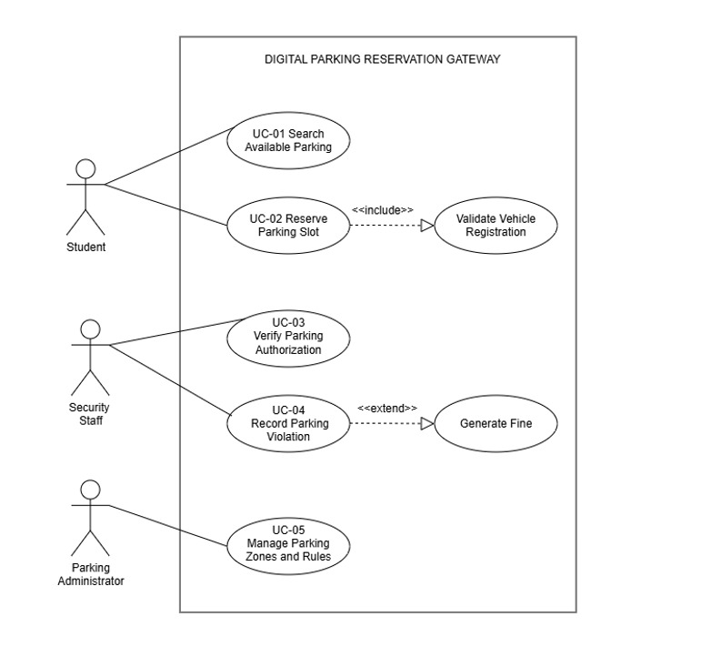
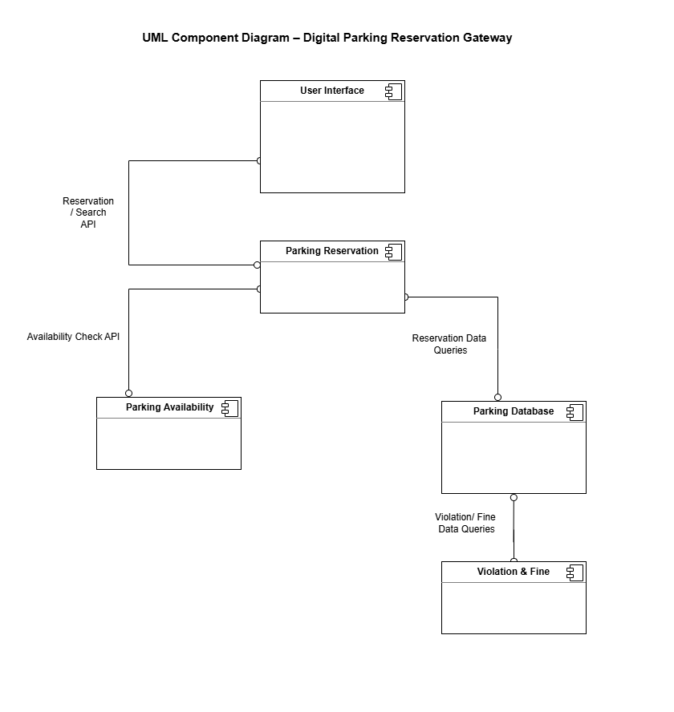

# Digital Parking Reservation Gateway

## Lab 1: Requirements Engineering & UML Use-Case Modelling

### Problem Statement

Digital Parking Reservation Gateway

### Primary Domain

Campus and Academic Operations

### Target Actors

- Student
- Security Staff
- Parking Administrator

## Deliverables

### 1. Requirements Specification

Contains:
- 5 Functional Requirements
- 2 Non-Functional Requirements
- Acceptance Criteria
- Rationale

[Requirements Table](requirements/requirements-table.md)

### 2. UML Use-Case Diagram

Contains:
- Student
- Security Staff
- Parking Administrator
- Primary system use cases
- `«include»` relationship
- `«extend»` relationship

### 3. Use-Case Flow Specification

Core use case:
- Reserve Parking Slot

[Use-Case Flow](use-case-flow/reserve-parking-slot.md)

# Lab 2

## Jira – Agile Project Management

The Digital Parking Reservation Gateway was planned and managed using Jira Scrum.
The backlog consisted of Epics and User Stories, which were estimated using Story
Points and divided into two sprints.

[View Lab 2 PDF](Lab2.pdf)

# Lab 3

## Component Modelling & Architectural Pattern Selection

The Digital Parking Reservation Gateway was modelled using a UML Component Diagram.
Client-Server Architecture was selected based on centralized management, data
consistency, security, and performance requirements.

### Deliverables

   
 [Architectural Justification](Lab3_Architectural_Justification.pdf)
